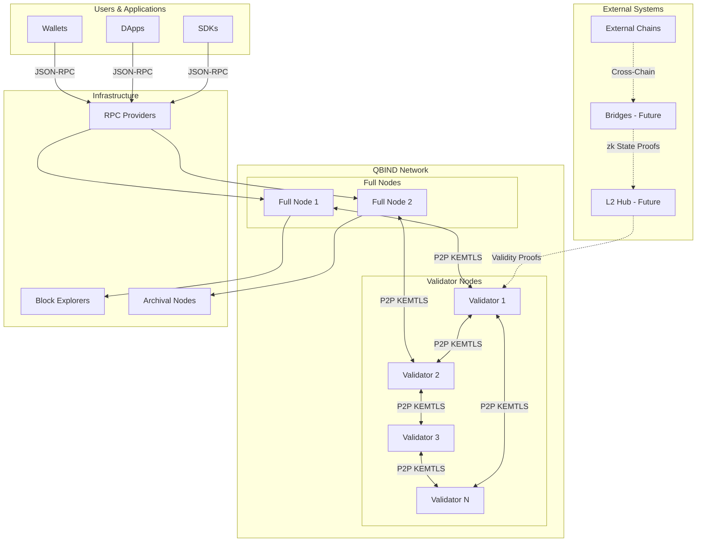
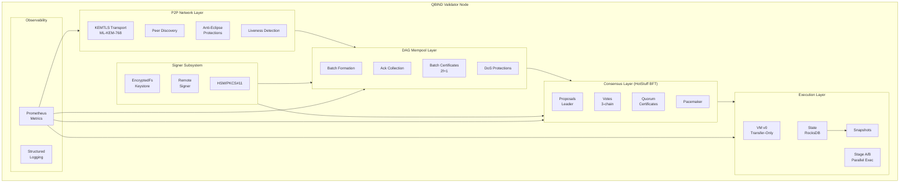
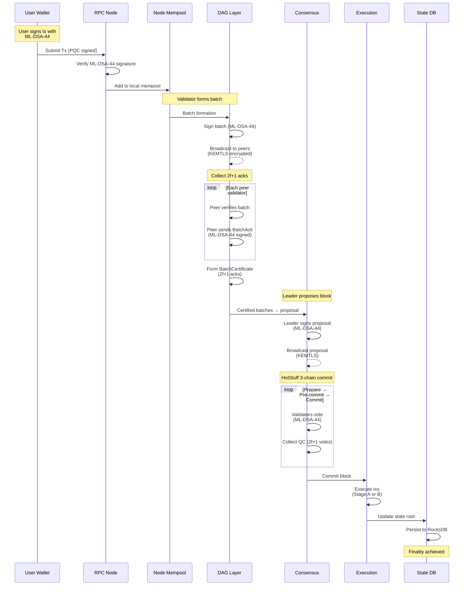
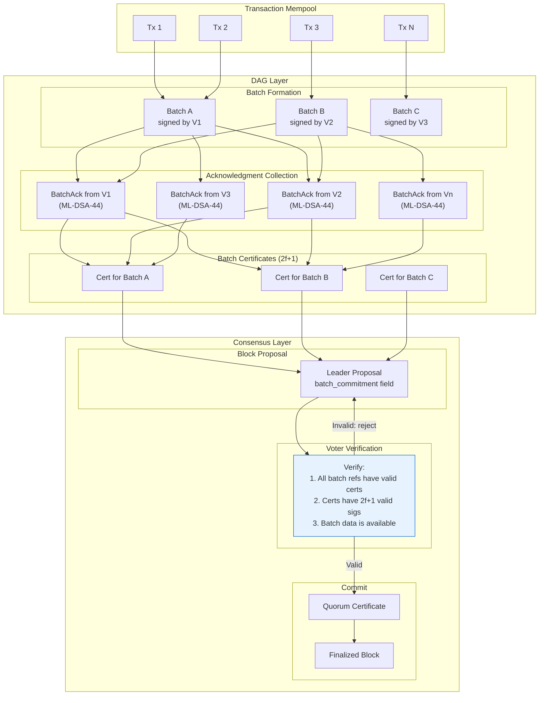
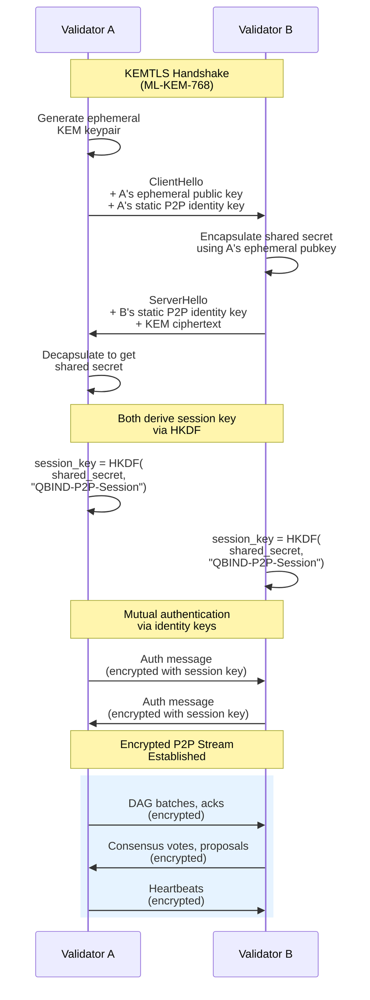
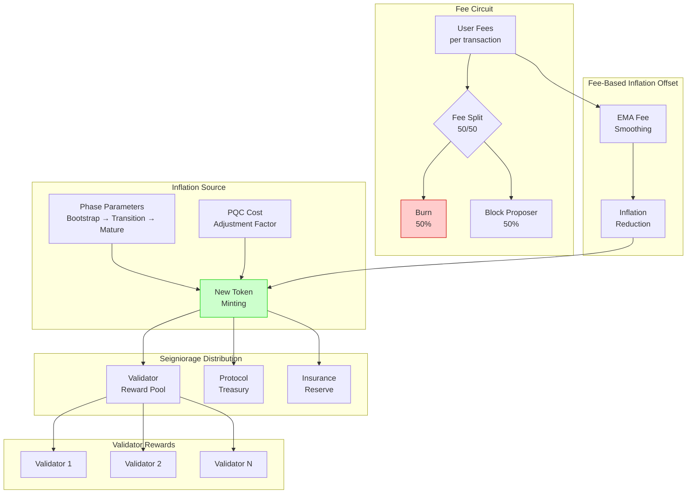
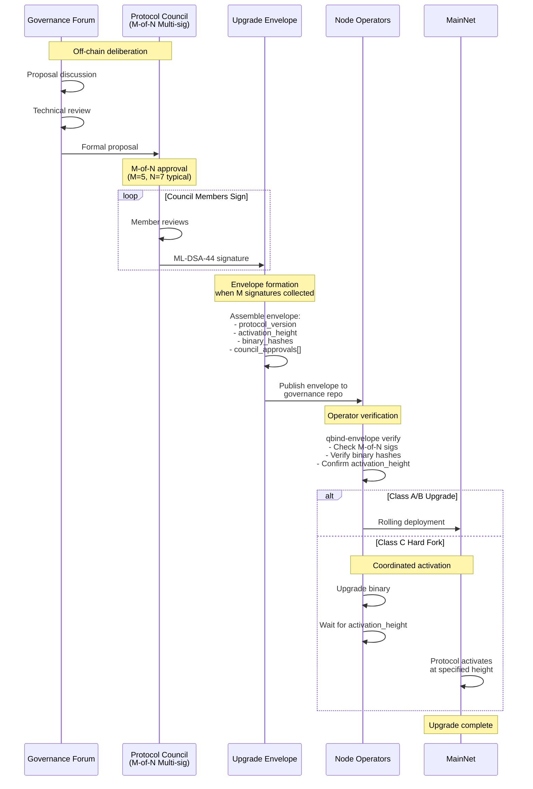

# QBIND Architecture Diagrams

Technical diagrams for the QBIND post-quantum Layer-1 blockchain protocol.

---

## 1. High-Level System Overview

### 1.1 QBIND Ecosystem

**Caption:** The QBIND ecosystem comprises user-facing clients (wallets, dApps, SDKs) that submit transactions via JSON-RPC to full nodes. Full nodes relay transactions to the validator network, which runs HotStuff BFT consensus. All validator-to-validator and node-to-node communication is secured via KEMTLS (ML-KEM-768). Block explorers and archival nodes index chain data for queries. Future L2 and bridge components (dashed lines) will connect external chains via zk validity proofs.

---

### 1.2 Validator Node Internals

**Caption:** A QBIND validator node is organized into layered subsystems. The **P2P layer** handles KEMTLS-secured transport, peer discovery, and anti-eclipse protections. The **DAG mempool** forms transaction batches, collects 2f+1 acknowledgments, and produces batch certificates. The **consensus layer** runs HotStuff BFT with proposals, votes, quorum certificates, and view-change pacemaker. The **execution layer** applies committed blocks via the VM v0 transfer engine with optional Stage B parallel execution, persisting state to RocksDB. The **signer subsystem** supports multiple key backends (encrypted filesystem, remote signer, HSM/PKCS#11). Prometheus metrics and structured logging provide observability across all layers.

---

## 2. Transaction Lifecycle "Circuit"

**Caption:** A transaction's lifecycle begins when a user wallet signs it with ML-DSA-44 and submits to an RPC node. The node verifies the signature and adds it to the local mempool. Periodically, validators form batches of pending transactions, sign them with ML-DSA-44, and broadcast to peers via KEMTLS-encrypted channels. Upon receiving a batch, peer validators verify and return signed BatchAck messages. Once 2f+1 acks are collected, a BatchCertificate is formed, proving data availability. The HotStuff leader includes certified batch references in its proposal, signs with ML-DSA-44, and broadcasts. Validators vote through the 3-chain commit rule (prepare → pre-commit → commit), each phase requiring a quorum certificate. Upon commit, the execution layer processes transactions and updates the state root in RocksDB.

---

## 3. DAG + Consensus Coupling

**Caption:** The DAG–consensus coupling mechanism prevents data-withholding attacks. Transactions are grouped into batches, each signed by the creating validator. Batches are disseminated to all validators, who return ML-DSA-44-signed BatchAck messages. Once a batch accumulates 2f+1 acknowledgments, a BatchCertificate is formed, cryptographically proving that a supermajority of validators have received the batch data. The HotStuff leader includes only certified batch references (the "DAG frontier") in its `batch_commitment` field. Before voting, each voter verifies: (1) all referenced batches have valid certificates, (2) each certificate contains 2f+1 valid ML-DSA-44 signatures, and (3) the voter possesses the actual batch data. If verification fails, the voter rejects the proposal. This coupling ensures committed blocks only reference provably-available data.

---

## 4. Networking / KEMTLS Handshake

**Caption:** KEMTLS provides post-quantum authenticated key exchange between validators. Validator A initiates by generating an ephemeral ML-KEM-768 keypair and sending its ephemeral public key plus static P2P identity key in ClientHello. Validator B encapsulates a shared secret using A's ephemeral public key and returns the ciphertext in ServerHello along with B's static identity key. A decapsulates to recover the shared secret. Both parties derive symmetric session keys using HKDF with domain separation ("QBIND-P2P-Session"). Mutual authentication is performed using the registered P2P identity keys. Once the handshake completes, all subsequent P2P traffic—DAG batches, acknowledgments, consensus messages, and heartbeats—flows over the encrypted channel. This provides quantum-resistant confidentiality and authentication for all validator communication.

---

## 5. Monetary Engine & Token Flows (Skeleton)

**Caption:** The QBIND monetary engine operates as a value circuit balancing inflation and fees. **Inflation** mints new tokens based on phase parameters (Bootstrap: ~8–9%, Transition: ~6–7%, Mature: ~4–5%), adjusted upward by PQC computational cost factors (β_compute, β_bandwidth, β_storage). Newly minted tokens flow to the validator reward pool (primary), protocol treasury (secondary), and insurance reserve. **Transaction fees** are split 50/50: half is burned (reducing supply), half goes to the block proposer. Fee revenue feeds into an EMA-smoothed offset mechanism that progressively reduces inflation as network usage grows. This creates a self-balancing system where security funding transitions from inflation-dominated (early) to fee-dominated (mature).

---

## 6. Governance & Upgrade Envelope

**Caption:** QBIND's governance flow uses off-chain deliberation with cryptographic accountability. Proposals are discussed in the governance forum and submitted to the Protocol Council for approval. Council members (N=7, threshold M=5) independently review and sign the proposal using ML-DSA-44. Once M signatures are collected, an Upgrade Envelope is assembled containing: protocol version, activation height, binary hashes (SHA3-256), and the array of council signatures. The envelope is published to the governance repository. Node operators verify the envelope using the `qbind-envelope verify` command, which checks signature validity, binary authenticity, and activation parameters. For Class A/B upgrades, operators deploy via rolling restart. For Class C hard forks, all operators upgrade their binaries before the coordinated activation height, at which point the network simultaneously activates the new protocol rules.

---

*End of Diagrams Document*