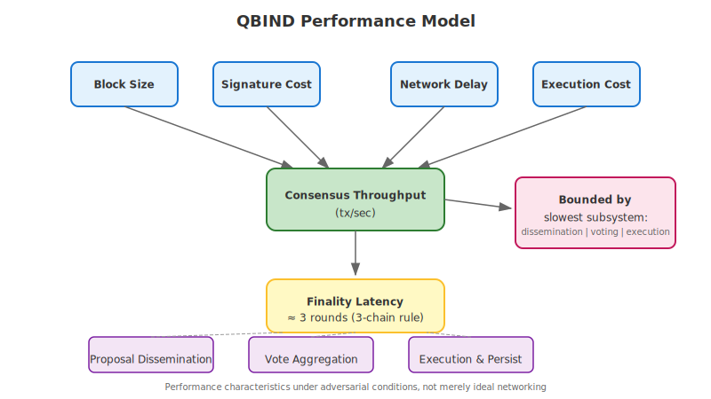
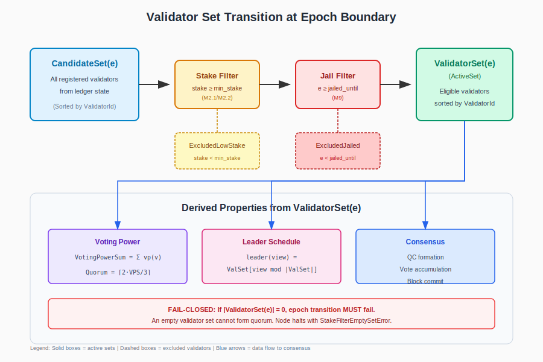

# QBIND Whitepaper
Version: Draft v3 (Full Technical Baseline)
Status: Technical Specification (No Tokenomics)

---

# 1. Abstract

QBIND is a post-quantum-secure Layer-1 blockchain implemented in Rust, designed for long-horizon security, cryptographic agility, and production-grade validator operation.

The system integrates:
- Post-quantum cryptography for authentication and key establishment
- A KEM-based secure networking layer
- A HotStuff-style BFT consensus engine
- A modular transaction execution runtime
- Persistent storage with explicit schema control

QBIND operates through three network environments:

- DevNet – development and rapid iteration
- TestNet – adversarial testing and performance validation
- MainNet – production-grade operation with strict safety rails

This document specifies the system architecture, networking model, consensus design, state model, and forward roadmap.

---

# 2. Design Philosophy

## 2.1 Security First

Security invariants are explicit and enforced in code:
- Quorum certificate validation
- Lock safety rules
- Nonce monotonicity
- Overflow protection
- Key zeroization

Performance improvements must not violate safety constraints.

## 2.2 Post-Quantum by Default

Authentication and session establishment are built around post-quantum primitives.  
The networking layer derives transcript-bound session keys and enforces strict nonce uniqueness.

## 2.3 Cryptographic Agility

Cryptographic suites are versioned and treated as first-class protocol components.  
Upgrades are governed and designed to avoid ambiguous consensus transitions.

## 2.4 Modular Architecture

QBIND separates:
- Networking
- Consensus
- Execution
- State management
- Storage
- Governance tooling

Each layer has clear responsibility boundaries.

## 2.5 Code-Driven Specification

This whitepaper reflects the current repository structure.  
Incomplete components are explicitly documented in the roadmap section.

---

# 3. System Overview

QBIND is structured as a layered architecture:

• Foundation Layer  
  - Types, hashing, and wire encoding  
  - Cryptographic primitives  

• Secure Networking Layer  
  - KEM-based handshake  
  - Transcript-bound key schedule  
  - AEAD encrypted transport framing  

• Consensus Layer  
  - HotStuff-style BFT  
  - 3-chain commit rule  
  - Quorum certificate formation  

• Execution & State Layer  
  - Account-based state model  
  - System programs  
  - Optional EVM execution  

• Node Layer  
  - P2P networking  
  - Mempool (including DAG module)  
  - Consensus driver  
  - RocksDB persistence  
  - Metrics & observability  

---

# 4. QBIND Node Architecture


The QBIND node integrates:

- RPC & CLI configuration
- Peer manager and P2P transport
- Secure session management
- Mempool (FIFO + DAG)
- Consensus engine
- Runtime execution
- Persistent storage

All network traffic passes through the secure session layer.
Consensus messages are validated before state transition.
Committed blocks are persisted before final acknowledgment.

---

# 5. Networking Security Properties

The secure channel derives independent client-to-server and server-to-client session keys.

Nonce structure:
flag (1 byte) || session_id (3 bytes) || counter (8 bytes)

The counter is monotonic and overflow results in session termination.

Handshake transcript binding ensures session keys depend on both parties' contributions.

---

# 6. Known Gaps (Current Implementation)

- DoS cookie enforcement in handshake is defined but not yet enforced.
- Timeout/view-change mechanics in the consensus driver are marked TODO.
- Slashing penalties are partially implemented; enforcement expansion is planned.

These are tracked roadmap items, not assumed guarantees.

---

# 7. Node Internal Architecture and Execution Flow

This section formalizes the internal runtime structure of a QBIND validator node based on the implemented codebase.


---

## 7.1 Async Runtime Model

QBIND uses a multi-threaded Tokio runtime initialized via:

    #[tokio::main]
    async fn main()

The runtime spawns independent asynchronous services responsible for networking, consensus progression, execution, and observability.

### Primary Services

- P2P demultiplexer loop
- Async consensus runner
- Metrics HTTP server (optional)
- Async execution worker
- Secure channel read/write workers
- Signature verification worker pool

Service communication follows an event-driven architecture.

### Communication Primitives

1. Bounded mpsc Channels  
   - Default capacity: 1024  
   - Used for consensus events and P2P message routing  
   - Provides built-in backpressure  

2. Shared State with Locking  
   - Mempool uses Arc<RwLock<...>> for concurrent access

---

# 8. Consensus Protocol Specification

QBIND implements a HotStuff-style Byzantine Fault Tolerant (BFT) consensus protocol with deterministic leader rotation and quorum certificate formation.

This section formalizes the protocol behavior as implemented.


---

## 8.1 System Model

Let:

- N = number of validators
- f = maximum Byzantine validators tolerated
- Quorum threshold = 2f + 1 voting power

Assumption:
N ≥ 3f + 1

Validators communicate over authenticated channels established via the secure networking layer.

---

## 8.2 Leader Election

Leader selection is deterministic:

leader(view) = validators[ view mod N ]

Each view has exactly one designated proposer.

No VRF-based or stake-weighted randomness is currently implemented.

---

## 8.3 Proposal Structure

A proposal contains:

- block_id
- parent block reference
- transaction payload
- justify QC (quorum certificate for previous block)

The justify QC binds the proposal to a previously certified block.

---

## 8.4 Voting Rule

A validator votes for proposal P in view v if:

1. P.justify_qc.height ≥ locked_height
2. P extends from the locked block
3. The validator has not voted for another proposal at (height, view)

Double-vote attempts are rejected.

---

## 8.5 Quorum Certificate (QC)

A QC is formed when ≥ 2f + 1 validators sign the same block hash at the same height and view.

QC structure:

- block_id
- height
- view
- aggregated signatures

QC validation is required before advancing to the next view.

---

## 8.6 3-Chain Commit Rule

QBIND follows a 3-chain commit rule:

If blocks B₀ → B₁ → B₂ → B₃ form a chain of consecutive QCs:

then B₀ becomes committed.

Commit occurs when a QC is observed for the grandchild of a block.

This guarantees safety under partial synchrony.

---

## 8.7 Locking Rule

Each validator maintains a locked_height.

Upon observing a QC at height h:

locked_height := h

Validators must not vote for proposals extending below locked_height.

This prevents conflicting commits.

---

## 8.8 Safety Property (Informal)

Under the assumption that at most f validators are Byzantine:

No two honest validators will commit conflicting blocks.

Reason:

- 2f + 1 quorum intersection ensures at least f + 1 honest overlap
- Lock rule prevents divergence
- 3-chain commit rule ensures finality consistency

---

## 8.9 Liveness Assumptions

Liveness requires:

- Eventually synchronous network
- Leader eventually honest
- Timeout/view-change mechanism functioning

Note:
Timeout/view-change logic is partially implemented and marked as TODO in driver components. Liveness under prolonged asynchrony is therefore not fully guaranteed in the current implementation.

---

## 8.10 Known Consensus Gaps

- Timeout and view-change logic incomplete
- Slashing penalties infrastructure present but not fully enforced
- Equivocation penalties deferred to future milestone

These limitations are explicitly tracked as roadmap items.

---

# 9. Cryptographic Architecture

QBIND is designed as a post-quantum-secure blockchain.  
All authentication and key establishment mechanisms are built around post-quantum cryptographic primitives.

This section formalizes the cryptographic roles and security boundaries.


---

## 9.1 Cryptographic Roles

QBIND defines distinct cryptographic roles:

1. Validator Signing Key  
   - Used for block proposals and votes  
   - Produces consensus signatures  

2. Network Key (KEM)  
   - Used for handshake-based session establishment  
   - Derives symmetric session keys  

3. Session AEAD Keys  
   - Derived per connection  
   - Used for encrypted message transport  

4. Governance / Council Keys  
   - Used to sign upgrade envelopes and parameter changes  

Key role separation prevents cross-layer compromise propagation.

---

## 9.2 Secure Networking (KEM-Based Handshake)

The secure channel is established via a KEM-based handshake.

Properties:

- Transcript-bound key derivation
- Per-direction symmetric keys
- Explicit nonce structure
- Overflow detection

Nonce format:

flag (1 byte) || session_id (3 bytes) || counter (8 bytes)

Session termination occurs on counter overflow to prevent nonce reuse.

Handshake keys are bound to both participants via transcript hashing.

---

## 9.3 Key Storage and Protection

QBIND supports:

- Plaintext keystore (development use)
- Encrypted keystore (PBKDF2 + AEAD)
- Remote signer daemon (HSM / airgapped support)

All private key material is wrapped with ZeroizeOnDrop semantics in memory.

MainNet safety rails require encrypted keystore or remote signer.

---

## 9.4 Remote Signer Isolation

The remote signer daemon:

- Isolates validator signing keys
- Signs consensus messages via authenticated channel
- Reduces risk of key exfiltration from validator node process

Remote signer failure behavior is configurable:
- Development mode: warning
- MainNet mode: process termination

---

## 9.5 Suite Versioning and Downgrade Protection

Cryptographic suites are versioned.

Runtime suite downgrade across epochs is rejected.

Suite downgrade attempts are treated as fatal security violations.

This prevents rollback attacks to weaker cryptographic parameters.

---

## 9.6 Cryptographic Agility Model

QBIND is designed to allow future suite upgrades without chain resets.

Upgrade path requirements:

- Governance-approved suite transition
- Epoch boundary activation
- Explicit compatibility rules
- State persistence compatibility

Cryptographic changes are treated as protocol events, not silent upgrades.

---

## 9.7 Known Gaps

- Full HSM PKCS#11 integration partially implemented
- Cookie-based DoS protection in handshake not enforced
- Expanded slashing for equivocation pending

These are roadmap items.

---

# 10. Transaction and State Model

QBIND uses an account-based state model with deterministic transaction execution.

This section formalizes the transaction format, execution semantics, and state persistence guarantees.


---

## 10.1 Transaction Structure

A transaction contains:

- msg_type
- version
- chain_id
- payer (account ID)
- nonce
- fee_limit
- account list
- program_id
- call_data
- authentication signatures

The transaction format is deterministic and fully serialized prior to consensus inclusion.

Replay protection is enforced via (payer, nonce).

---

## 10.2 Account Model

Each account contains:

- account_id (32 bytes)
- owner (program identifier)
- balance (lamports)
- executable flag
- rent_epoch
- arbitrary data payload

Accounts are modified only through program execution.

State transitions are deterministic across validators.

---

## 10.3 Execution Model

Transaction execution occurs only after block commit.

Execution flow:

1. Decode transactions from committed block
2. Validate signatures and nonce
3. Execute via runtime
4. Apply state changes
5. Remove committed transactions from mempool

Execution is deterministic given identical input state.

Optional EVM execution is supported via integration with the runtime engine.

---

## 10.4 Gas Accounting

Each transaction specifies:

- fee_limit
- effective gas cost

Execution fails if gas exceeds fee_limit.

Gas prevents:

- Infinite loops
- Resource exhaustion
- Denial-of-service via heavy computation

MainNet enforces gas accounting strictly.

---

## 10.5 Persistence Guarantees

Upon commit:

1. State changes applied in memory
2. Block persisted
3. QC persisted
4. last_committed updated

Restart safety is guaranteed via durable RocksDB writes.

Schema version mismatches prevent startup.

---

## 10.6 Determinism Requirements

Consensus safety requires:

- Identical transaction ordering within block
- Deterministic execution engine
- Deterministic gas metering
- Deterministic serialization

Non-deterministic execution would violate safety.

---

## 10.7 Known Gaps

- Advanced state pruning not yet implemented
- ~~Full formal gas model documentation pending~~ → See Section 19: Gas Accounting and Deterministic Metering Model
- Expanded slashing economics pending

---

# 11. Upgrade and Governance Safety Model

QBIND treats protocol upgrades and cryptographic suite transitions as explicit, consensus-aware events.

Upgrades are not silent software changes; they are state transitions governed by protocol rules.


---

## 11.1 Upgrade Activation Model

Upgrades are activated at epoch boundaries.

An upgrade must satisfy:

1. Governance approval
2. Inclusion in a committed block
3. Activation height or epoch specification
4. Validator compatibility enforcement

Nodes that do not support the activated upgrade will fail startup or halt.

This prevents ambiguous fork conditions.

---

## 11.2 Governance Envelope

Governance actions are packaged in signed envelopes.

Envelope properties:

- Versioned format
- Signed by authorized council keys
- Verifiable before application
- Persisted for auditability

Upgrade envelopes may modify:

- Cryptographic suite parameters
- Network configuration
- Economic parameters
- Validator set rules

---

## 11.3 Cryptographic Suite Transition Safety

Suite transitions must:

- Occur at epoch boundary
- Be forward-compatible
- Reject downgrade attempts
- Maintain deterministic state compatibility

Suite downgrade across epochs is rejected as a fatal violation.

---

## 11.4 MainNet Safety Rails

MainNet enforces stricter conditions than DevNet/TestNet:

- Gas accounting must be enabled
- P2P networking must be enabled
- Encrypted keystore or remote signer required
- Genesis hash validated at startup
- Schema version compatibility enforced

Nodes violating these conditions terminate.

---

## 11.5 Failure Containment

If an upgrade activation fails validation:

- The block is rejected
- The QC is invalidated
- No state transition occurs

This prevents partial upgrade activation.

---

## 11.6 Future Governance Enhancements

Planned improvements include:

- Expanded slashing enforcement
- Formalized economic governance specification
- Automated upgrade simulation in TestNet
- Cryptographic agility test harness

Governance evolution is designed to remain deterministic and auditable.

---

# 12. Adversarial Analysis

This section models adversarial conditions under which QBIND must preserve safety and, where possible, liveness.


---

## 12.1 Threat Model

QBIND assumes:

- Up to f Byzantine validators (where N ≥ 3f + 1)
- Adversarial network capable of:
  - Message delay
  - Message reordering
  - Packet dropping
  - Partitioning
- Malicious clients submitting invalid transactions
- Attempted cryptographic downgrade or replay attacks

The protocol does not assume trusted networking infrastructure.

---

## 12.2 Byzantine Validator Behavior

Possible malicious behaviors:

- Double voting at same height/view
- Proposing conflicting blocks
- Withholding votes
- Delaying quorum formation

Mitigations:

- Double-vote rejection at validator level
- Lock rule prevents conflicting commits
- 2f + 1 quorum intersection ensures safety
- Slashing penalties enforced via `SlashingPenaltySchedule`

Safety remains intact if ≤ f validators are Byzantine.

### 12.2.1 Slashing Penalty Schedule

The following table defines the formal penalty schedule for all offense classes (O1-O5). Each offense is objectively verifiable via cryptographic evidence and enforced deterministically.

| Offense | Name | Evidence Type | Verification Rule | Slash (bps) | Jail (epochs) |
|---------|------|---------------|-------------------|-------------|---------------|
| **O1** | Double-signing | Two conflicting `SignedBlockHeader` at same height/view | Verify both ML-DSA-44 signatures against validator's consensus public key; require height/view match with different block IDs; validator must be scheduled leader | 750 (7.5%) | 10 |
| **O2** | Invalid proposer signature | `BlockHeader` + invalid signature bytes | Attempt ML-DSA-44 verification of signature against proposer's public key; verification must fail | 500 (5%) | 5 |
| **O3** | Invalid vote (lazy/malicious) | `SignedVote` + `LazyVoteInvalidReason` | Verify vote signature against voter's public key; verify voted-on block is provably invalid (e.g., bad proposer signature, invalid QC) | 300 (3%) | 3 |
| **O4** | Censorship (proposal withholding) | `DagCertificate` + `DagValidationFailure` | Verify certificate signatures failed quorum or individual signature invalid; fail-closed on non-verifiable evidence | 200 (2%) | 2 |
| **O5** | Availability failure | `BlockHeader` + `DagStateProof` | Verify block's `batch_commitment` has no valid DAG certificate; proof must show absence in DAG state | 100 (1%) | 1 |

**Verification Semantics:**
- All evidence is **objectively verifiable**: any node can independently validate using public information.
- Verification is **deterministic**: the same evidence always produces the same verification result.
- Verification is **fail-closed**: evidence that cannot be verified is rejected (no false positives).
- Cryptographic verification uses **ML-DSA-44** (suite_id = 0x03) for production validators.

### 12.2.2 Governance and Activation Semantics

Slashing penalties are governed via the `SlashingPenaltySchedule` struct stored in `ParamRegistry`. This schedule contains the `slash_bps` (slash rate in basis points) and `jail_epochs` (jail duration) for each offense class O1-O5, plus an `activation_epoch` field that specifies when the schedule takes effect.

**Activation Rules:**
- Schedule changes activate **only at epoch boundaries**, not mid-epoch.
- The active schedule for epoch N is the most recently activated schedule where `activation_epoch ≤ N`.
- This ensures deterministic penalty application across all nodes and prevents mid-epoch economic state divergence.

**Environment Behavior:**
- **MainNet / TestNet**: Fail-closed if `SlashingPenaltySchedule` is missing from `ParamRegistry`. The node refuses to start or process blocks without an explicit penalty schedule.
- **DevNet**: May fall back to default schedule values for development convenience, but logs a warning.

---

## 12.3 Network-Level Attacks

### Replay Attacks

Mitigated by:

- Nonce-based replay protection in transactions
- Monotonic session nonce in secure channel

Session termination occurs on nonce overflow.

---

### Message Reordering / Delay

HotStuff safety is preserved under partial synchrony.

Liveness depends on eventual synchrony and functional timeout mechanisms.

Timeout/view-change is partially implemented and remains a roadmap item.

---

### DoS Attacks

Potential vectors:

- Flooding mempool
- Handshake resource exhaustion
- Oversized blocks
- Execution-heavy transactions

Mitigations:

- Gas limits per transaction
- Bounded mpsc channels (backpressure)
- Session-level AEAD framing
- MainNet gas enforcement

Cookie-based handshake DoS mitigation is defined but not yet enforced.

---

## 12.4 Key Compromise Scenarios

### Validator Signing Key Compromise

Impact:
- Malicious votes or proposals from compromised validator

Mitigation:
- BFT threshold prevents unilateral commit
- Slashing planned for economic deterrence
- Remote signer isolation reduces exposure surface

---

### Network KEM Key Compromise

Impact:
- Impersonation or MITM attempt

Mitigation:
- Transcript-bound key derivation
- Identity binding via delegation certificates
- Session re-establishment required

---

## 12.5 Crash and Restart Safety

Crash during commit:

- Durable RocksDB writes ensure restart consistency
- last_committed marker prevents state regression
- Schema mismatch prevents unsafe startup

Epoch transition writes storage before in-memory update to preserve atomicity.

---

## 12.6 Upgrade Attack Scenarios

### Partial Upgrade Activation

Mitigation:
- Activation only at epoch boundary
- Invalid upgrade blocks rejected
- Non-compatible nodes halt

---

### Suite Downgrade Attempt

Mitigation:
- Downgrade rejected as fatal violation
- Versioned suite enforcement

---

## 12.7 Residual Risks

- Liveness under prolonged asynchrony until timeout logic finalized
- Incomplete slashing economics
- Cookie-based DoS protection not yet active
- Future cryptographic breakthroughs

QBIND explicitly tracks these risks as roadmap items rather than silent assumptions.

---

# 13. Performance and Scalability Model

QBIND is designed for high throughput and low latency under adversarial conditions, not merely under ideal networking.

This section describes performance characteristics and scalability constraints.



---

## 13.1 Throughput Determinants

Throughput is influenced by:

- Block size
- Transaction size
- Execution cost per transaction
- Signature verification throughput
- Network propagation delay
- Quorum formation latency

Consensus throughput is bounded by the slowest of:

1. Proposal dissemination
2. Vote aggregation
3. Execution and state persistence

---

## 13.2 Latency Model

Finality latency (ideal case):

≈ 3 consensus rounds (3-chain rule)

Latency increases under:

- Network delay
- View changes
- Leader failures

Timeout/view-change optimization is a roadmap item.

---

## 13.3 Parallelism Strategy

QBIND employs:

- Parallel signature verification workers
- Async execution worker
- Bounded channel backpressure
- Optional DAG-based mempool for improved block assembly

Future scalability enhancements may include:

- Optimized async peer management
- Enhanced DAG-to-consensus coupling
- Parallel transaction execution (subject to deterministic constraints)

---

## 13.4 Bottlenecks

Primary scaling bottlenecks:

- Cryptographic verification cost
- State write amplification in RocksDB
- Network bandwidth limits
- Execution engine complexity

These are explicitly acknowledged rather than abstracted away.

---

## 13.5 Scalability Roadmap

Planned improvements:

- Timeout/view-change optimization
- Expanded slashing and penalty enforcement
- Improved DoS cookie enforcement
- Enhanced HSM integration
- Advanced state pruning
- Deterministic parallel execution exploration

All scalability improvements must preserve safety invariants defined in Sections 8–12.

---

# 14. Long-Term Cryptographic Roadmap

QBIND is designed for long-horizon cryptographic resilience.

---

## 14.1 Post-Quantum Commitment

All authentication and key establishment mechanisms are based on post-quantum primitives.

QBIND does not rely on classical hardness assumptions for validator authentication.

---

## 14.2 Suite Evolution

Future suite upgrades may include:

- Parameter strength increases
- Alternative PQ signature schemes
- Alternative KEM constructions
- Aggregation optimizations

All transitions must follow governance-controlled epoch activation.

---

## 14.3 Research Alignment

QBIND monitors:

- NIST post-quantum standardization outcomes
- Cryptanalysis developments
- Performance improvements in PQ primitives

Suite transitions are designed to be non-disruptive and deterministic.

---

## 14.4 Conservative Upgrade Philosophy

QBIND prioritizes:

- Stability over novelty
- Security over speculative performance gains
- Formal review before activation

Long-term viability depends on disciplined upgrade control.

---

# 15. Conclusion

QBIND is a post-quantum-secure Layer-1 blockchain designed with explicit safety invariants, deterministic execution, and cryptographic agility as foundational principles.

The system integrates:

- A KEM-based secure networking layer
- A HotStuff-style BFT consensus protocol
- Deterministic account-based execution
- Strict nonce and replay protections
- Governance-controlled upgrade activation
- Explicit adversarial modeling

Known gaps are documented transparently and treated as roadmap items rather than implicit guarantees.

QBIND prioritizes:

- Safety over speculative throughput
- Upgrade discipline over silent transitions
- Cryptographic resilience over short-term optimization

The long-term viability of QBIND depends on continued cryptographic review, rigorous adversarial testing, and conservative protocol evolution.

This document reflects the current implemented architecture and serves as a technical specification baseline for further development, audit, and deployment.

---

# 16. Formal State Transition Model

This section defines QBIND's consensus-critical global state and the deterministic state transition rules applied at commit.

QBIND's state is modeled as a tuple. Some components are persisted (durable) and others are in-memory only (runtime), but both can be consensus-relevant.

---

## 16.1 Global State Tuple

Define the global protocol state **S** as:

```
S = (
    Accounts,           // Map<AccountId, Account>
    Nonces,             // Map<AccountId, u64>
    ValidatorSet,       // Set<ValidatorSetEntry>
    Epoch,              // EpochId (u64)
    SuiteRegistry,      // SuiteRegistry
    ParamRegistry,      // ParamRegistry
    MonetaryState,      // MonetaryEpochState
    SlashingState,      // Map<ValidatorId, ValidatorSlashingState>
    KeyRotationState,   // KeyRotationRegistry

    // Consensus-specific
    LockedQC,           // Option<QuorumCertificate>
    LockedHeight,       // u64
    LastCommittedBlock, // Option<BlockId>
    CommittedHeight,    // u64

    // View state
    CurrentView,        // u64
    LastVoted,          // Option<(Height, Round, BlockId)>

    // Persistence markers
    SchemaVersion       // u32
)
```

---

## 16.2 Durable vs Runtime State

| Component | Persistence | Consensus-Critical | Location |
|-----------|-------------|-------------------|----------|
| Accounts | Durable | ✅ Yes | RocksDB `acct:<id>` |
| Nonces | Durable | ✅ Yes | RocksDB `nonce:<id>` |
| ValidatorSet | Runtime | ✅ Yes | Loaded from genesis/config; updated at epoch boundaries |
| Epoch | Durable | ✅ Yes | RocksDB `meta:current_epoch` |
| SuiteRegistry | Durable | ✅ Yes | Account data |
| ParamRegistry | Durable | ✅ Yes | Account data |
| MonetaryState | Mixed | ✅ Yes | Account data / in-memory |
| SlashingState | Runtime | ✅ Yes | In-memory (T230) |
| KeyRotationState | Runtime | ✅ Yes | In-memory until epoch advance |
| LockedQC | Runtime | ✅ Yes | Reconstructed from last committed |
| LockedHeight | Runtime | ✅ Yes | Derived from LockedQC |
| LastCommittedBlock | Durable | ✅ Yes | RocksDB `meta:last_committed` |
| CommittedHeight | Runtime | ✅ Yes | Derived from last committed |
| CurrentView | Runtime | ⚠️ Liveness | Pacemaker state |
| LastVoted | Runtime | ✅ Yes | Double-vote prevention |
| SchemaVersion | Durable | ⚠️ Startup | RocksDB `meta:schema_version` |

---

## 16.3 State Transition Function

The global state transition function is defined as:

```
δ: S × Input → S' × Output
```

Where **Input** is one of:

- `Transaction(tx)` — User transaction execution
- `BlockCommit(block, qc)` — Finalization of a committed block
- `EpochBoundary(new_epoch)` — Epoch transition event
- `UpgradeActivation(upgrade)` — Governance-approved protocol upgrade
- `SlashingEvidence(evidence)` — Byzantine behavior evidence
- `ViewChange(new_view)` — Consensus view advancement

And **Output** captures:

- State mutation records
- Emitted events
- Error conditions

---

## 16.4 State Mutation Rules

### 16.4.1 Transaction Execution

Upon transaction `tx` applied to state `S`:

1. Verify `tx.nonce == Nonces[tx.payer]`
2. Verify `Accounts[tx.payer].balance >= tx.fee_limit`
3. Execute via runtime
4. Deduct gas from payer balance
5. Apply account mutations
6. Increment `Nonces[tx.payer]`

Execution is deterministic given identical input state.

### 16.4.2 Block Commit

Upon committing block `B` with quorum certificate `QC`:

```
S' = S with:
    LastCommittedBlock := B.id
    CommittedHeight := B.height
    Accounts := apply_transactions(S.Accounts, B.transactions)
    Nonces := increment_nonces(S.Nonces, B.transactions)
    LockedQC := QC  (if QC.height > S.LockedHeight)
    LockedHeight := max(S.LockedHeight, QC.height)
```

Persistence order:

1. Persist block at `b:<block_id>`
2. Persist QC at `q:<block_id>`
3. Update `meta:last_committed`

### 16.4.3 Epoch Transition

Upon epoch boundary from epoch `e` to `e + 1`:

```
S' = S with:
    Epoch := e + 1
    ValidatorSet := compute_next_validator_set(S)
    MonetaryState := compute_monetary_epoch(S, e + 1)
    KeyRotationState := advance_key_rotations(S.KeyRotationState, e + 1)
    SlashingState := process_unjails(S.SlashingState, e + 1)
```

Epoch is persisted to storage before in-memory state is updated.

### 16.4.4 Slashing Evidence

Upon valid slashing evidence `E` for validator `V`:

```
S' = S with:
    SlashingState[V].offense_count := S.SlashingState[V].offense_count + 1
    SlashingState[V].jailed := true  (if penalty threshold exceeded)
```

Note: Actual stake burning is deferred to T229+ implementation.

---

## 16.5 Commit Procedure

The commit procedure ensures atomicity and crash safety:

1. **Pre-commit validation**
   - Verify 3-chain rule satisfied
   - Verify QC has sufficient voting power

2. **Durable writes (atomic batch)**
   - Write block to `b:<block_id>`
   - Write QC to `q:<block_id>`
   - Update `meta:last_committed`

3. **In-memory state update**
   - Update LockedQC, LockedHeight
   - Apply account mutations
   - Update nonces

4. **Post-commit cleanup**
   - Remove committed transactions from mempool
   - Emit commit notification

Writes 1-3 MUST complete before in-memory updates proceed.

---

## 16.6 Determinism Requirements

Consensus safety requires all validators to compute identical state from identical input.

| Requirement | Enforcement |
|-------------|-------------|
| Transaction ordering | Block defines canonical order |
| Execution semantics | Deterministic runtime |
| Gas metering | Fixed cost model |
| Serialization | Canonical wire format |
| Floating-point | Prohibited in consensus path |
| Time-dependent logic | Uses block height/epoch, not wall-clock |

Non-deterministic execution violates safety and would cause chain forks.

---

## 16.7 Crash Recovery Model

Upon restart, state is recovered as follows:

| State Component | Recovery Method |
|-----------------|-----------------|
| LastCommittedBlock | Read `meta:last_committed` |
| Epoch | Read `meta:current_epoch` |
| LockedQC | Reconstruct from committed chain |
| LockedHeight | Derive from LockedQC |
| CurrentView | Start from committed view + 1 |
| LastVoted | Reset (conservative: may re-vote) |
| Mempool | Empty (clients resubmit) |
| SlashingState | Lost (T230 limitation) |

Recovery invariant: A restarted node MUST NOT commit a block that conflicts with its pre-crash commits.

---

## 16.8 Known Limitations

- Slashing state is in-memory only; evidence lost on restart (T230)
- Vote history subject to memory eviction
- Key rotation state not persisted until epoch advance
- Epoch transition has narrow crash-vulnerability window: a crash between epoch key persistence and in-memory update may cause inconsistent state

These are tracked as roadmap items.

---

# 17. View-Change and Liveness Model

QBIND implements a HotStuff-style consensus protocol with deterministic round-robin leader rotation.

This section formalizes view progression and liveness assumptions.

---

## 17.1 View and Leader Definition

Let:

- view ∈ ℕ
- N = number of validators

Leader selection is deterministic:

leader(view) = ValidatorSet[ view mod N ]

Each view has exactly one designated proposer.

---

## 17.2 Pacemaker State

Each validator maintains:

- CurrentView
- LockedQC
- HighestQC
- TimeoutCounter

Pacemaker state is runtime (in-memory) and reconstructed via synchronization after restart.

---

## 17.3 Timeout Trigger

A timeout event occurs if:

- A validator does not receive a valid proposal for the current view within a bounded time window, or
- A quorum certificate is not formed within the expected round duration.

Timeout duration may increase exponentially under repeated failures.

Timeout mechanics are partially implemented and remain a pre-TestNet requirement.

---

## 17.4 View Advancement Rule

Upon timeout:

1. CurrentView := CurrentView + 1
2. Broadcast timeout message (future extension)
3. Await proposal from leader(CurrentView)

A validator must not decrease its view number.

View advancement must preserve:

- LockedHeight invariant
- Safety of previously formed QCs

---

## 17.5 Safety Under View Change

Safety is preserved if:

- A validator only votes for proposals extending from blocks with justify_qc.height ≥ locked_height
- View changes do not alter commit rule semantics
- No validator double-votes at same (height, view)

Because quorum intersection guarantees overlap of ≥ f+1 honest validators, conflicting commits cannot occur.

---

## 17.6 Liveness Assumptions

QBIND assumes partial synchrony:

There exists a Global Stabilization Time (GST) after which:

- Message delays are bounded
- Honest leader eventually appears
- Timeout duration exceeds network delay

Under these conditions, progress resumes and new blocks are committed.

---

## 17.7 Current Limitations

The current implementation includes:

- Deterministic leader rotation
- Partial timeout scaffolding

However:

- Full timeout broadcast aggregation is not yet implemented
- Formal liveness proof is not included
- View-change optimization remains roadmap item

Until full timeout logic is implemented, liveness under prolonged asynchrony is not guaranteed.

---

# 18. Validator Set Transition and Epoch Boundary Semantics

This section formally specifies the validator set transition model at epoch boundaries. It defines how validators become eligible for inclusion in the active consensus set, how the validator set is constructed deterministically, and the transition rules when moving between epochs.

---

## 18.1 Definitions

### 18.1.1 Epoch and Validator Identifiers

| Term | Type | Definition |
|------|------|------------|
| `EpochId` | `u64` | Sequential epoch number, starting from 0 at genesis. |
| `EpochBoundary` | Event | The commit of a reconfiguration block that triggers epoch transition. |
| `ValidatorId` | `u64` | Unique canonical identifier for a validator. |

### 18.1.2 ValidatorRecord Fields

The `ValidatorRecord` structure (stored on-chain in account data) contains:

| Field | Type | Description |
|-------|------|-------------|
| `stake` | `u64` | Validator's current stake in microQBIND. |
| `consensus_suite_id` | `u8` | Cryptographic suite ID for consensus signatures. |
| `status` | `ValidatorStatus` | Enum: `Inactive`, `Active`, `Jailed`, `Exiting`. |
| `owner_keyset_id` | `AccountId` | Account that owns/controls this validator. |
| `consensus_pk` | `Vec<u8>` | Public key for consensus signing. |
| `last_slash_height` | `u64` | Block height of last slashing event. |

### 18.1.3 Jail State (Runtime)

Jailing is tracked in runtime slashing state:

| Field | Type | Description |
|-------|------|-------------|
| `jailed_until_epoch` | `Option<u64>` | Epoch until which the validator is jailed (exclusive). `None` = not jailed. |

A validator is **jailed at epoch e** if:

```
jailed_until_epoch.is_some() AND e < jailed_until_epoch.unwrap()
```

### 18.1.4 Validator Sets

| Set | Definition |
|-----|------------|
| `CandidateSet(epoch)` | All validators registered for epoch participation, before filtering. |
| `ActiveSet(epoch)` | Validators included in the consensus committee after eligibility filtering. Also called `ValidatorSet(epoch)`. |
| `JailedSet(epoch)` | Validators excluded from `ActiveSet` due to `jailed_until_epoch > epoch`. |
| `ExcludedLowStake(epoch)` | Validators excluded from `ActiveSet` due to `stake < min_validator_stake`. |

### 18.1.5 Deterministic Ordering Requirements

All validator set operations **must** produce deterministic, identical results across all honest nodes:

1. Validators are sorted by `ValidatorId` (ascending) before filtering.
2. Filtering predicates use `>=` comparisons (inclusive of threshold).
3. The same inputs always produce the same outputs.
4. No randomness, wall-clock time, or node-local state influences ordering.

---

## 18.2 Eligibility Function

### 18.2.1 Formal Predicate

A validator `v` is **eligible** for epoch `e` if:

```
Eligible(v, e) :=
    stake(v) >= min_validator_stake(e)
 ∧  e >= jailed_until_epoch(v)
 ∧  suite_id(v) ∈ AllowedSuites(e)
 ∧  status(v) ∈ {Active, Registered}
```

Where:

- `stake(v)`: The on-chain `ValidatorRecord.stake` value (in microQBIND).
- `min_validator_stake(e)`: Environment-dependent minimum stake threshold.
- `jailed_until_epoch(v)`: From runtime slashing state; `0` if not jailed.
- `suite_id(v)`: The `ValidatorRecord.consensus_suite_id` value.
- `AllowedSuites(e)`: Set of permitted cryptographic suite IDs for epoch `e`.
- `status(v)`: The `ValidatorRecord.status` value.

### 18.2.2 Minimum Stake Source

The `min_validator_stake` threshold is configured per environment:

| Environment | Value | Configuration Source |
|-------------|-------|---------------------|
| DevNet | 1,000,000 µQBIND (1 QBIND) | `ValidatorStakeConfig::devnet_default()` |
| TestNet | 10,000,000 µQBIND (10 QBIND) | `ValidatorStakeConfig::testnet_default()` |
| MainNet | 100,000,000,000 µQBIND (100,000 QBIND) | `ValidatorStakeConfig::mainnet_default()` |

The value is sourced from `NodeConfig.validator_stake.min_validator_stake` at node startup and remains constant for the node's lifetime. Governance-driven changes to minimum stake apply at the next epoch boundary after the governance action commits.

### 18.2.3 Jail Semantics

Jailing provides strict exclusion:

- A jailed validator is **excluded from all consensus participation** until `jailed_until_epoch` is reached.
- Jail periods are expressed in epochs, not blocks or wall-clock time.
- Jail durations by offense class (M9/M11):
  - O1 (Double Vote): 5 epochs
  - O2 (Equivocation): 5 epochs
  - O3 (Invalid Vote): 3 epochs
  - O4 (Censorship): 2 epochs
  - O5 (Availability Failure): 1 epoch

At epoch boundary `e`, validators with `jailed_until_epoch <= e` are **automatically unjailed** and become eligible candidates.

### 18.2.4 Suite Enforcement Semantics

For TestNet and MainNet, cryptographic suite enforcement is mandatory:

| Environment | Allowed Suites | Enforcement Function |
|-------------|---------------|---------------------|
| DevNet | All registered suites | No enforcement |
| TestNet | `{ML_DSA_44_SUITE_ID}` (100) | `validate_testnet_invariants()` |
| MainNet | `{ML_DSA_44_SUITE_ID}` (100) | `validate_mainnet_validator_suites()` |

Validators using non-allowed suites are **rejected at startup** rather than filtered at epoch boundary. This fail-fast behavior prevents cryptographic verification ambiguity.

---

## 18.3 Construction of ValidatorSet

### 18.3.1 Formal Definition

The validator set for epoch `e` is constructed as:

```
ValidatorSet(e) = SortBy(ValidatorId, { v ∈ CandidateSet(e) | Eligible(v, e) })
```

Where:
- `SortBy(ValidatorId, S)` returns set `S` sorted by ascending `ValidatorId`.
- `CandidateSet(e)` is the pre-filtering set of all registered validators.
- `Eligible(v, e)` is the eligibility predicate from Section 18.2.1.

### 18.3.2 Construction Algorithm

The construction proceeds in two phases:

**Phase 1: Stake Filtering**

```
StakeFiltered = { v ∈ CandidateSet | stake(v) >= min_validator_stake }
ExcludedLowStake = CandidateSet \ StakeFiltered
```

**Phase 2: Jail Filtering**

```
JailFiltered = { v ∈ StakeFiltered | NOT is_jailed_at_epoch(v, e) }
ExcludedJailed = StakeFiltered \ JailFiltered
```

**Output**

```
ValidatorSet(e) = SortBy(ValidatorId, JailFiltered)
```

The implementation uses `build_validator_set_with_stake_and_jail_filter()` which combines both phases.

### 18.3.3 Voting Power and Quorum

Each validator in `ValidatorSet(e)` has an associated `voting_power` value.

```
VotingPowerSum(e) = Σ voting_power(v) for all v ∈ ValidatorSet(e)

QuorumThreshold(e) = ceil(2 * VotingPowerSum(e) / 3)
```

A quorum is achieved when the sum of voting powers for participating validators is `>= QuorumThreshold(e)`.

### 18.3.4 Leader Schedule

The leader for a view is determined by round-robin:

```
leader(view, e) = ValidatorSet(e)[ view mod |ValidatorSet(e)| ]
```

This ensures deterministic leader assignment based on sorted validator order.

---

## 18.4 Transition Function at Epoch Boundary

### 18.4.1 Trigger Condition

An epoch transition is triggered when a reconfiguration block commits. A block is a reconfig block if:

```
block.payload_type == BlockPayloadType::Reconfig(ReconfigPayload { next_epoch })
```

### 18.4.2 State Mutation Rules

Upon epoch boundary from epoch `e` to `e + 1`:

```
S' = S with:
    Epoch := e + 1
    ValidatorSet := compute_validator_set(CandidateSet, e + 1, min_validator_stake)
    SlashingState := process_unjails(S.SlashingState, e + 1)
    KeyRotationState := advance_key_rotations(S.KeyRotationState, e + 1)
```

Where:

1. **ValidatorSet Update**:
   - `CandidateSet` is derived from registered validators in ledger state.
   - `compute_validator_set` applies stake + jail filtering for epoch `e + 1`.
   - The new validator set takes effect immediately for view `0` of epoch `e + 1`.

2. **Jail State Processing**:
   - For each validator `v` with `jailed_until_epoch(v) <= e + 1`:
     - Clear jail flag (becomes eligible).
   - Jailed validators persist in `SlashingState` but may now be eligible.

3. **Stake Updates**:
   - Any slashing applied in epoch `e` reduces `ValidatorRecord.stake`.
   - Stake reductions are **atomic** with slashing evidence processing.
   - Reduced stake is reflected in epoch `e + 1` eligibility check.

4. **Suite Changes**:
   - Governance-driven suite transitions activate at epoch boundary.
   - `AllowedSuites(e + 1)` may differ from `AllowedSuites(e)`.
   - Validators using deprecated suites become ineligible.

### 18.4.3 Persistence Order

To ensure crash safety, the epoch transition follows strict persistence ordering:

1. **Persist new epoch number** to `meta:current_epoch`.
2. **Persist validator set** (or reference to it).
3. **Update in-memory state** (EpochState, ValidatorSet, etc.).
4. **Notify consensus engine** of new epoch.

If a crash occurs after step 1 but before step 3, recovery reconstructs in-memory state from persisted epoch.

---

## 18.5 Failure Conditions and Fail-Closed Rules

### 18.5.1 Empty Validator Set

**Condition**: Stake and/or jail filtering excludes all validators.

**Response**: Node halts with `StakeFilterEmptySetError`.

**Rationale**: An empty validator set cannot form quorum. Proceeding would deadlock consensus.

**Implementation**: `ConsensusValidatorSet::new()` returns `Err` if input is empty.

### 18.5.2 Incompatible Suite IDs

**Condition**: At startup, a validator uses a suite not in `AllowedSuites` for the environment.

**Response**: Node rejects configuration and fails to start.

**Rationale**: Cryptographic verification requires a known, verifiable signature suite. Unknown suites cannot be verified, breaking consensus safety.

**Implementation**: `validate_testnet_invariants()`, `validate_mainnet_validator_suites()`.

### 18.5.3 Invalid Epoch State Transition

**Condition**: `EpochStateProvider.get_epoch_state(e + 1)` returns `None`.

**Response**: Epoch transition fails. Reconfig block is rejected.

**Rationale**: Without a valid next-epoch state, the node cannot determine the new validator set.

**Implementation**: `NodeHotstuffHarness.handle_reconfig_block()` fails if provider returns `None`.

### 18.5.4 Duplicate ValidatorId

**Condition**: Two validators in `CandidateSet` have the same `ValidatorId`.

**Response**: Validator set construction fails with `"duplicate ValidatorId"` error.

**Rationale**: `ValidatorId` must be unique for deterministic indexing and leader selection.

**Implementation**: `ConsensusValidatorSet::new()` checks for duplicates.

### 18.5.5 MainNet Minimum Stake Violation

**Condition**: `min_validator_stake < MIN_VALIDATOR_STAKE_MAINNET` on MainNet.

**Response**: Configuration validation fails at startup.

**Rationale**: Economic security requires sufficient stake at risk for slashing to be meaningful.

**Implementation**: `ValidatorStakeConfig::validate_for_mainnet()`.

---

## 18.6 Code Mapping

This section maps formal elements to implementation locations.

### 18.6.1 Core Types

| Formal Element | File | Location |
|----------------|------|----------|
| `ValidatorId` | `crates/qbind-consensus/src/ids.rs` | `ValidatorId` struct |
| `ValidatorRecord` | `crates/qbind-types/src/state_validator.rs` | `ValidatorRecord` struct |
| `ValidatorStatus` | `crates/qbind-types/src/state_validator.rs` | `ValidatorStatus` enum |
| `EpochId` | `crates/qbind-consensus/src/validator_set.rs` | `EpochId` newtype |
| `ValidatorSetEntry` | `crates/qbind-consensus/src/validator_set.rs` | `ValidatorSetEntry` struct |
| `ConsensusValidatorSet` | `crates/qbind-consensus/src/validator_set.rs` | `ConsensusValidatorSet` struct |

### 18.6.2 Stake Filtering

| Function | File | Line Range | Purpose |
|----------|------|------------|---------|
| `build_validator_set_with_stake_filter()` | `crates/qbind-consensus/src/validator_set.rs` | 146-178 | M2.1: Stake-only filtering |
| `build_validator_set_with_stake_and_jail_filter()` | `crates/qbind-consensus/src/validator_set.rs` | 275-342 | M9: Combined stake + jail filtering |
| `ValidatorCandidate` | `crates/qbind-consensus/src/validator_set.rs` | 66-86 | Candidate with stake info |
| `ValidatorCandidateWithJailStatus` | `crates/qbind-consensus/src/validator_set.rs` | 189-217 | Candidate with jail info |

### 18.6.3 Epoch State Provider

| Component | File | Line Range | Purpose |
|-----------|------|------------|---------|
| `EpochStateProvider` trait | `crates/qbind-consensus/src/validator_set.rs` | 966-971 | Provider interface |
| `StaticEpochStateProvider` | `crates/qbind-consensus/src/validator_set.rs` | 995-1044 | Test provider |
| `StakeFilteringEpochStateProvider` | `crates/qbind-consensus/src/validator_set.rs` | 1078-1242 | M2.2: Production provider |
| `StakeFilterEmptySetError` | `crates/qbind-consensus/src/validator_set.rs` | 1056-1076 | Fail-closed error |

### 18.6.4 Epoch Transition Wiring

| Component | File | Line Range | Purpose |
|-----------|------|------------|---------|
| `with_epoch_state_provider()` | `crates/qbind-node/src/hotstuff_node_sim.rs` | 928-930 | Wire provider to harness |
| `with_stake_filtering_epoch_state_provider()` | `crates/qbind-node/src/hotstuff_node_sim.rs` | 978-990 | M2.3: Wire filtering provider |
| `enable_stake_filtering_for_environment()` | `crates/qbind-node/src/hotstuff_node_sim.rs` | 1037-1047 | M2.4: Production wiring |
| `new_with_stake_filtering()` | `crates/qbind-node/src/hotstuff_node_sim.rs` | 2422-2436 | Production constructor |
| `transition_to_epoch()` | `crates/qbind-consensus/src/basic_hotstuff_engine.rs` | (called at 3370 in node_sim) | Engine epoch update |

### 18.6.5 Configuration Enforcement

| Component | File | Line Range | Purpose |
|-----------|------|------------|---------|
| `ValidatorStakeConfig` | `crates/qbind-node/src/node_config.rs` | 2403-2483 | Stake config struct |
| `min_validator_stake` constants | `crates/qbind-node/src/node_config.rs` | 2367-2375 | Per-environment defaults |
| `validate_testnet_invariants()` | `crates/qbind-node/src/node_config.rs` | 6625-6648 | TestNet suite check |
| `validate_mainnet_validator_suites()` | `crates/qbind-node/src/node_config.rs` | 6680-6684 | MainNet suite check |
| `ML_DSA_44_SUITE_ID` | `crates/qbind-node/src/node_config.rs` | ~6510 | Suite constant (100) |

### 18.6.6 Quorum and Leader

| Component | File | Line Range | Purpose |
|-----------|------|------------|---------|
| `total_voting_power()` | `crates/qbind-consensus/src/validator_set.rs` | 416-419 | Sum of voting powers |
| `two_thirds_vp()` | `crates/qbind-consensus/src/validator_set.rs` | 469-473 | Quorum threshold |
| `has_quorum()` | `crates/qbind-consensus/src/validator_set.rs` | 478-491 | Quorum check |
| `leader_for_view()` | `crates/qbind-consensus/src/basic_hotstuff_engine.rs` | 607-618 | Leader selection |

---

## 18.7 Diagram



The diagram shows the flow from `CandidateSet` through stake filtering, jail filtering, to the final `ActiveSet` (ValidatorSet), which is then used for quorum and leader schedule computation.

---

## 18.8 Invariants

The following invariants must hold for validator set transitions:

1. **Non-Empty Set**: `|ValidatorSet(e)| >= 1` for all epochs `e` on TestNet/MainNet.
2. **Determinism**: Two nodes with identical inputs produce identical `ValidatorSet(e)`.
3. **Monotonic Epochs**: Epoch numbers are strictly increasing.
4. **Sorted Order**: `ValidatorSet(e)` is sorted by `ValidatorId` ascending.
5. **Unique IDs**: No two entries in `ValidatorSet(e)` share a `ValidatorId`.
6. **Quorum Possible**: `VotingPowerSum(e) > 0` (required for quorum math).
7. **Suite Compliance**: All validators in `ValidatorSet(e)` use allowed suites.

---

## 18.9 Known Limitations

1. **Voting Power as Stake Proxy**: The current `StakeFilteringEpochStateProvider` uses `voting_power` as a proxy for stake in test configurations. Production deployments must read actual `ValidatorRecord.stake` from ledger.

2. **Slashing State Volatility**: `jailed_until_epoch` is in runtime slashing state, which is not fully persistent (T230). A crash may lose jail state, potentially allowing jailed validators to re-enter the set prematurely.

3. **Governance Stake Changes**: Governance-driven changes to `min_validator_stake` require node restart to take effect. Dynamic reconfiguration is a future enhancement.

4. **No Dynamic Suite Transitions**: Mid-epoch suite transitions are rejected. Suite changes require full epoch boundary activation.

These limitations are tracked as roadmap items and do not affect core safety properties.

---

# 19. Gas Accounting and Deterministic Metering Model

This section formalizes the QBIND gas accounting model, providing formal definitions for gas state variables, transition functions, and determinism requirements. Gas metering is critical for resource accounting, DoS prevention, and economic sustainability.

---

## 19.1 Gas State Variables

### 19.1.1 Transaction-Level Variables

| Variable | Type | Description |
|----------|------|-------------|
| `gas_limit_tx` | `u64` | Maximum gas the sender authorizes for transaction execution |
| `gas_used_tx` | `u64` | Actual gas consumed by transaction execution |
| `max_fee_per_gas` | `u128` | Maximum fee per gas unit the sender will pay |
| `max_priority_fee_per_gas` | `u128` | Maximum tip per gas unit (EIP-1559 compatible) |

### 19.1.2 Block-Level Variables

| Variable | Type | Description |
|----------|------|-------------|
| `block_gas_limit` | `u64` | Maximum gas allowed per block (default: 30,000,000) |
| `gas_used_block` | `u64` | Cumulative gas consumed by all transactions in the block |
| `base_fee_per_gas` | `u128` | Current base fee per gas unit |

### 19.1.3 Account-Level Variables

| Variable | Type | Description |
|----------|------|-------------|
| `Account.balance` | `u128` | Account balance in native tokens |
| `Account.nonce` | `u64` | Account transaction counter |

### 19.1.4 Execution Result

The execution result `ExecutionResult` is defined as:

```
ExecutionResult = (success: bool, gas_used: u64, fee_burned: u128, fee_to_proposer: u128)
```

### 19.1.5 Fundamental Invariants

The following invariants MUST hold for all valid transactions and blocks:

```
INV-1: gas_used_tx ≤ gas_limit_tx
INV-2: gas_used_block ≤ block_gas_limit
INV-3: ∀ account: Account.balance ≥ 0 (no negative balances)
INV-4: All arithmetic uses checked operations (no overflow/underflow)
```

### 19.1.6 Gas Deduction Semantics

- **Upfront Deduction**: The maximum possible fee (`gas_limit_tx × max_fee_per_gas`) is checked against sender balance before execution begins.
- **Refund Semantics**: Unused gas (`gas_limit_tx - gas_used_tx`) is effectively refunded by only deducting `gas_used_tx × effective_gas_price`.
- **No Negative Balances**: If `balance < gas_limit_tx × max_fee_per_gas`, the transaction is rejected before execution.

---

## 19.2 Formal Gas Transition Function

### 19.2.1 Extended State Transition

The gas-aware state transition function extends the base transition `δ`:

```
δ_gas : (S, Tx) → (S', ExecutionResult)
```

Where:
- `S` is the pre-state (accounts, storage, etc.)
- `Tx` is the transaction
- `S'` is the post-state
- `ExecutionResult` contains the execution outcome

### 19.2.2 Pre-Execution Checks

Before execution, the following checks MUST pass:

```
PRE-1: balance(sender) ≥ gas_limit_tx × max_fee_per_gas
PRE-2: gas_limit_tx ≤ block_remaining_gas
PRE-3: nonce(sender) == tx.nonce
PRE-4: max_fee_per_gas ≥ base_fee_per_gas
```

If any check fails, the transaction is rejected and excluded from the block.

### 19.2.3 Execution Phase

During execution:

```
1. effective_gas_price = base_fee + min(max_priority_fee, max_fee - base_fee)
2. Execute transaction logic
3. Increment gas_used_tx deterministically per opcode/operation
4. If gas_used_tx > gas_limit_tx: HALT with OutOfGas
```

### 19.2.4 Gas Cost Formula

For VM v0 transfers:

```
gas(tx) = GAS_BASE_TX
        + GAS_PER_ACCOUNT_READ  × num_reads
        + GAS_PER_ACCOUNT_WRITE × num_writes
        + GAS_PER_BYTE_PAYLOAD  × payload_len
```

With constants:
- `GAS_BASE_TX = 21,000`
- `GAS_PER_ACCOUNT_READ = 2,600`
- `GAS_PER_ACCOUNT_WRITE = 5,000`
- `GAS_PER_BYTE_PAYLOAD = 16`

### 19.2.5 Finalization Phase

Upon successful execution:

```
1. total_fee = gas_used_tx × effective_gas_price
2. (fee_burned, fee_to_proposer) = distribute_fee(total_fee, policy)
3. balance(sender) -= (amount + total_fee)  [checked arithmetic]
4. balance(recipient) += amount             [checked arithmetic]
5. balance(proposer) += fee_to_proposer     [checked arithmetic]
6. nonce(sender) += 1                       [checked arithmetic]
7. Persist state atomically
```

### 19.2.6 Failure Semantics

On execution failure (revert, out-of-gas, etc.):

```
1. State changes are REVERTED (except gas deduction)
2. Gas is still consumed up to the point of failure
3. Sender pays: gas_used_tx × effective_gas_price
4. No state mutations persist except balance/nonce changes for gas payment
```

### 19.2.7 Fail-Closed Rule

**CRITICAL**: If any of the following occur, the block is INVALID:

- Arithmetic overflow in gas or fee calculations
- Arithmetic underflow in balance deductions
- Gas metering inconsistency (`gas_used_tx > gas_limit_tx`)
- Block gas inconsistency (`gas_used_block > block_gas_limit`)

The node MUST reject such blocks and NOT apply any state changes.

---

## 19.3 Determinism Requirements

### 19.3.1 Gas Cost Determinism

Gas costs MUST depend ONLY on:

1. **Opcode**: The specific operation being executed
2. **Input Size**: The size of inputs (e.g., payload bytes)
3. **Deterministic State Access**: The number of reads/writes
4. **Static Configuration**: Gas constants from protocol parameters

### 19.3.2 Prohibited Dependencies

Gas calculations MUST NOT depend on:

- Wall clock time
- Random values
- Environment-dependent values (filesystem, network state)
- Validator identity
- Non-deterministic memory allocation

### 19.3.3 Determinism Verification

Two nodes with identical:
- Pre-state `S`
- Transaction `Tx`
- Protocol parameters

MUST produce identical:
- `gas_used_tx`
- `S'` (post-state)
- `ExecutionResult`

---

## 19.4 Crash-Safety and Atomicity

### 19.4.1 Atomic Commit Requirement

Gas accounting MUST be committed atomically with state changes (reference: M16 Epoch Transition Hardening).

```
ATOM-1: Gas deduction and state changes commit together or not at all
ATOM-2: No partial gas persistence is permitted
ATOM-3: On crash, recovery restores a self-consistent state
```

### 19.4.2 Persistence Order

For each committed block:

1. Compute all transaction results (including gas)
2. Write state changes + gas accounting in a single atomic batch
3. Update `last_committed` marker
4. Only then acknowledge block commit

### 19.4.3 Recovery Behavior

On restart after crash:

- If atomic batch completed: State reflects all gas changes
- If atomic batch did not complete: State reflects pre-batch state
- Never: Partial gas accounting (some txs charged, others not)

---

## 19.5 Formal Invariants

### 19.5.1 Balance Invariants

```
BAL-1: ∀ account, ∀ time: balance(account) ≥ 0
BAL-2: Gas deduction ≤ sender balance (enforced at PRE-1)
BAL-3: No balance can become negative through any execution path
```

### 19.5.2 Supply Conservation

```
SUP-1: Total supply is conserved except for explicit burn operations
SUP-2: sum(all_balances) + total_burned = initial_supply + total_minted
SUP-3: Fee distribution: fee_burned + fee_to_proposer = total_fee (exactly)
```

### 19.5.3 Consensus Determinism

```
DET-1: Same block → same gas_used_block across all nodes
DET-2: Same transaction → same gas_used_tx across all nodes
DET-3: Same inputs → same ExecutionResult across all nodes
```

### 19.5.4 Overflow Protection

```
OVF-1: All u64 gas arithmetic uses checked operations
OVF-2: All u128 fee arithmetic uses checked operations
OVF-3: Overflow in any calculation → transaction/block rejection
```

---

## 19.6 Code Mapping

| Formal Element | File | Location |
|----------------|------|----------|
| `gas_limit_tx` | `crates/qbind-runtime/src/qbind_tx.rs` | `QbindTx.gas_limit` |
| `gas_used_tx` | `crates/qbind-runtime/src/execution_engine.rs` | `TxReceipt.gas_used` |
| `block_gas_limit` | `crates/qbind-ledger/src/execution_gas.rs` | `BLOCK_GAS_LIMIT_DEFAULT` |
| `GasModelConfig` | `crates/qbind-runtime/src/gas_model.rs` | `GasModelConfig` struct |
| `compute_gas_charges` | `crates/qbind-runtime/src/gas_model.rs` | `compute_gas_charges()` |
| `gas_for_transfer_v0` | `crates/qbind-ledger/src/execution_gas.rs` | `gas_for_transfer_v0()` |
| `ExecutionGasConfig` | `crates/qbind-ledger/src/execution_gas.rs` | `ExecutionGasConfig` struct |
| `FeeDistributionPolicy` | `crates/qbind-ledger/src/execution_gas.rs` | `FeeDistributionPolicy` struct |
| `apply_qbind_block` | `crates/qbind-runtime/src/block_apply.rs` | `apply_qbind_block()` |

---

## 19.7 Known Limitations

1. **EVM Gas Model**: EVM transactions use Revm's internal gas model. The formal model here applies to native QBIND VM v0 transactions. EVM compatibility is maintained through Revm's metering.

2. **Dynamic Base Fee**: The current implementation uses a fixed base fee. EIP-1559 style dynamic base fee adjustment is a future enhancement.

3. **Gas Refunds**: Unlike Ethereum, QBIND v0 does not implement SSTORE gas refunds. All gas spent is final.

4. **Cross-Shard Metering**: Multi-shard execution (future) will require additional metering rules for cross-shard calls.

These limitations do not affect core safety or determinism properties.